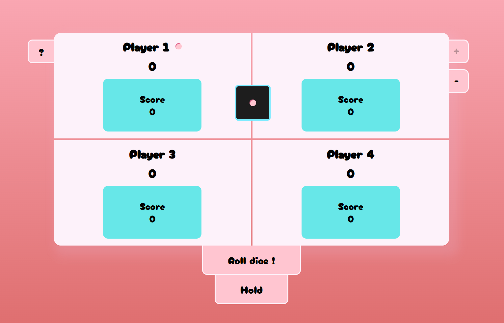

<h1 align="center">Pig Game</h1>

<h2 align="center"><a  href="https://space8rain.github.io/pig-game/">Live Demo</a></h2>

## Description

The Pig Game.
The aim of the game is to throw a bone and score 100 points. The turn is a series of rolls and consists of the following: the player rolls the die an unlimited number of times and adds up the values. However, if he rolls a one, the whole sum gained during the turn is annulled and the turn passes to the next player. A player can end his turn at any time.

There is an option to add/remove a player. Min 2, max 4.

Stack:
* React.js
* CRA
* JavaScript (ES6)
* HTML5
* CSS3\SCSS