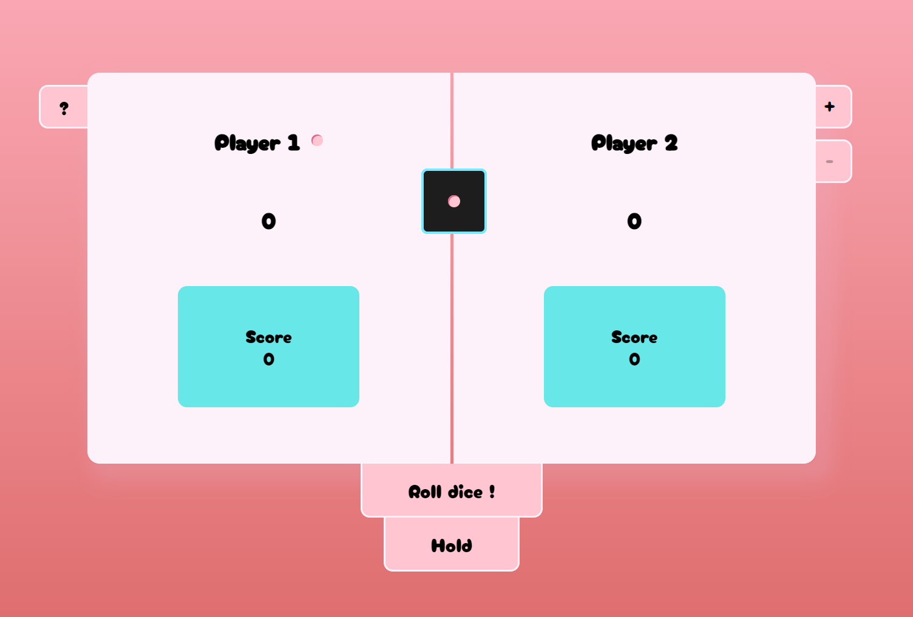

<h1 align="center">Pig Game</h1>

<h2 align="center"><a  href="https://space8rain.github.io/Pet-To-Do/">Live Demo</a></h2>

## Description

A simple pet project made in JS
Implemented:
* Switch theme
* Adding/removing tasks
* Mark completed
* Drag and Drop (using the <a  href="https://github.com/SortableJS/Sortable">Sortable Library</a>)
* Saving to local storage